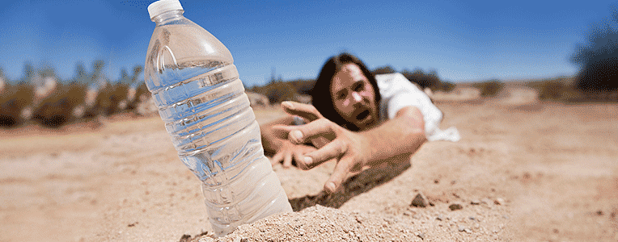

# ~Dubai~

**stop wasting your time on the ground, visit the sky**

---

## Unsure if Dubai is for you?

**Don't be!!**

Dubai has many cultural highlights and things to do, as well as all the glamorous modern add-ons.Here is a couple of places everyone will enjoy:

- The Jumeirah Beach

- The Aquarium in Dubai Mall

- The Dubai Mall

- The Burj Khalifaby the Dubai Mall

- Wild Wadi Waterpark

## Worried about the heat?

Heard the stories of the scorching Dubai sun? Are you starting to regret or doubt going to Dubai?

**Well, stop right there**

 A solution has been found.You can now buy the new and improved Fan Deluxe 2341 in John Lewis.
 This amazing invention includes:
 - a ten year long battery

 - plays music out loud or can be attached to speakers 

 - allows you to control the speed of the spinning of the fan

## Want to know how other people got on in Dubai?
Heres a couple of reviews on Dubai:
-  
 'Beautiful, Brilliant and Breathtaking.'-by Caitlin23

-  
'One of a kind - an experience that is incomparable' - ValerieMitala

-  
'Out of this world!!'-radiyathegreatest
 
## The Burj Khalifa 
The Burj Khalifa, previously known as the Burj Dubai, is a skyscraper in Dubai, United Arab Emirates. the total cost of the construction of the burj khalifa is $1.5 billion. At 2,717 feet high, the Burj Khalifa is not only the world's tallest building, but is a full 1,046 feet higher than the world's previous record-holder, Taipei 101 in Taiwan. the burj khalifa is three times the height of the Effiel Tower and twice the size of the Empire State builidng. 

## Best places for families:
Dubai is a place for everyone and so there are many places that you can visit with the childrean and adults.These places are also usually under-budget and provide some of the best experiences.Here they are:

- 1 IMG WORLDS OF ADVENTURES                                                                                    This indoor park is best for adventurous thrill seekers...

- 2 MotionGate Dubai                                                                                         This park is best for action seekers

- 3 Legoland Dubai                                                                                              This park has adventures for all ages

- 4 Legoland Water Park                                                                                       This park is best for the little sea creatures 

## IF IT'S NOT RISKY WHAT'S THE FUN ??
Are you an adrenaline junkie? Do you pretty much operate on adrenaline?
If yes, you are in luck. Dubai has some of th most scariest, full of thrill sports that you can try. here are a few:
- sky diving
- jet packing
- quad biking
- And believe it or not,  camel riding 
