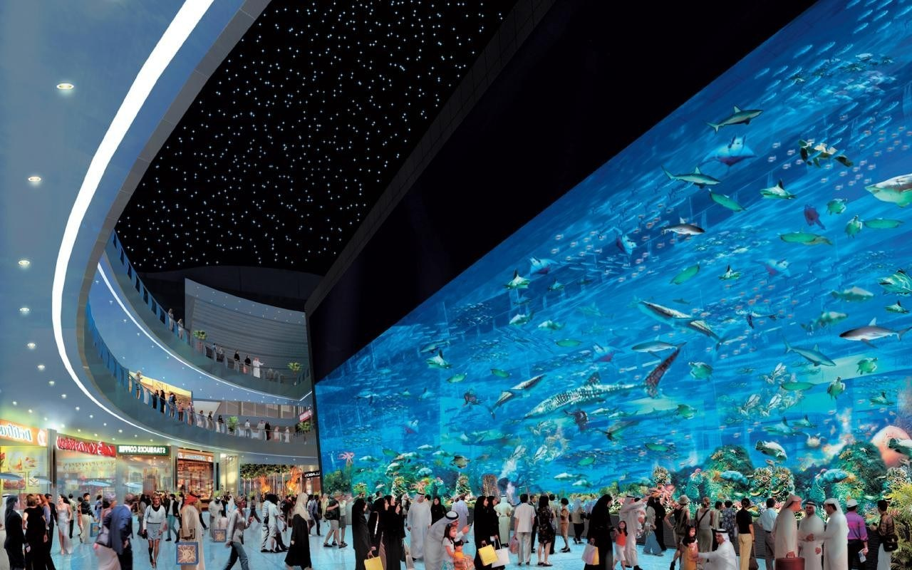

# ~Dubai~

**stop wasting your time on the ground, visit the sky**

---

## Unsure if Dubai is for you?

**Don't be!!**

Dubai has many cultural highlights and things to do, as well as all the glamorous modern add-ons.Here is a couple of places everyone will enjoy:

- 
*The Jumeirah Beach*

- 
*The Aquarium in Dubai Mall*

- 
*The Dubai Mall*

- 
*The Burj Khalifaby the Dubai Mall*

## Worried about the heat?

Heard the stories of the scorching Dubai sun? Are you starting to regret or doubt going to Dubai?

**Well, stop right there**

 A solution has been found.You can now buy the new and improved Fan Deluxe 2341 in John Lewis.
 This amazing invention includes:
 - a ten year long battery

 - plays music out loud or can be attached to speakers 

 - allows you to control the speed of the spinning of the fan

## Want to know how other people got on in Dubai?
Heres a couple of reviews on Dubai:

